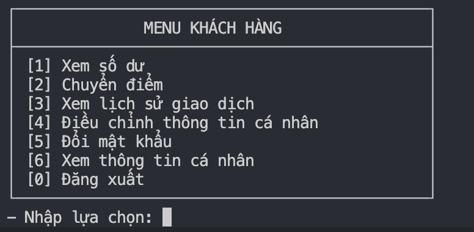
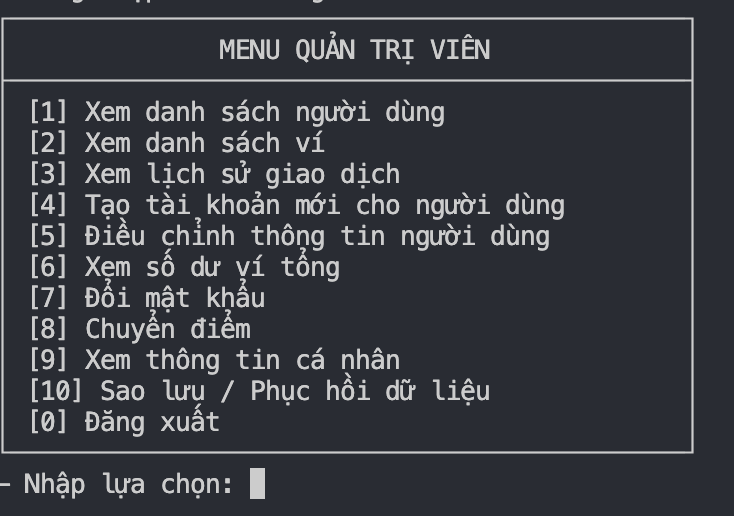

# 💳 Hệ thống Đăng nhập và Quản lý Ví Điểm Thưởng

## 📋 Mục lục

- [Giới thiệu dự án](#-giới-thiệu-dự-án)
- [Thành viên dự án](#-thành-viên-dự-án)
- [Phân tích và đặc tả chức năng](#-phân-tích-và-đặc-tả-chức-năng)
- [Tính năng chính](#-tính-năng-chính)
- [Kiến trúc hệ thống](#️-kiến-trúc-hệ-thống)
- [Công nghệ sử dụng](#️-công-nghệ-sử-dụng)
- [Cài đặt và chạy](#-cài-đặt-và-chạy)
- [Sử dụng](#-sử-dụng)
- [Cấu trúc dự án](#-cấu-trúc-dự-án)
- [Bảo mật](#-bảo-mật)
- [Tài liệu tham khảo](#-tài-liệu-tham-khảo)

## 🎯 Giới thiệu dự án

Hệ thống Đăng nhập và Quản lý Ví Điểm Thưởng là một ứng dụng console được phát triển bằng C++ nhằm quản lý tài khoản người dùng và hệ thống ví điểm thưởng. Dự án này cho phép người dùng đăng ký, đăng nhập, quản lý thông tin cá nhân và thực hiện các giao dịch chuyển điểm giữa các ví một cách an toàn và hiệu quả.

### 🎪 Mục tiêu dự án

- Xây dựng hệ thống quản lý tài khoản người dùng với bảo mật cao
- Triển khai cơ chế ví điểm thưởng giao dịch
- Áp dụng xác thực OTP cho các giao dịch quan trọng
- Thực hiện quản lý vai trò người dùng (User/Admin)
- Đảm bảo tính toàn vẹn dữ liệu trong các giao dịch chuyển điểm

## 👥 Thành viên dự án


### 👨‍💻 Danh sách thành viên

#### 1. **LÊ VĂN MẠNH** (K25DTCN137) — Nhóm trưởng
**Công việc:**
- Quản lý đăng nhập:
   - Đăng nhập và đăng kí
   - Sinh mật khẩu tự động khi đăng ký hoặc do admin tạo
   - Thay đổi mật khẩu với xác thực OTP
   - Xác thực đăng nhập bằng bcrypt
- Quản lý hoạt động ví:
   - Tạo ví cho user mới, quản lý ví hệ thống
   - Đảm bảo các giao dịch tuân thủ nguyên tắc ACID (atomic, rollback nếu lỗi)
   - Ghi log giao dịch, cập nhật trạng thái giao dịch
- Bảo mật:
   - Thiết lập hệ thống OTP

#### 2. **NGÔ PHƯƠNG CHI.** (K25DTCN130) — Thành viên
**Công việc:**
- Quản lý thông tin người dùng:
   - Chức năng người dùng tự cập nhật thông tin cá nhân
   - Validate input khi đăng nhập và đăng ký
- Tài liệu và chú thích:
   - Làm chú thích cho các phần: views, utils, exceptions, controllers
   - Làm tài liệu dự án
- Thiết kế database

#### 3. **ĐỖ THANH HÀ** (K25DTCN152) — Thành viên
**Công việc:**
- Quản lý dữ liệu và hiển thị:
   - Hiển thị và format bảng user
   - Seed data khi khởi tạo project lần đầu
- Tài liệu và chú thích:
   - Làm chú thích cho các phần: seeds, services, models
   - Làm hướng dẫn setup project
- Kiểm thử phần mềm

#### 4. **VŨ THỊ LAN PHƯƠNG** (K25DTCN187) — Thành viên
**Công việc:**
- Quản lý lịch sử và backup:
   - Chức năng lịch sử giao dịch cho ví User và tra cứu lịch sử giao dịch cho admin
   - Backup data, lịch sử backup
   - Restore data đã backup trong ds lịch sử
   - Restore data theo link, file data copy
- Hỗ trợ hệ thống:
   - Chức năng hỗ trợ hiển tiếng Việt cho win

## 📊 Phân tích và đặc tả chức năng

### 🎯 Yêu cầu chức năng

#### A.1 Tạo mới tài khoản khi đăng ký

- **Mô tả**: Hệ thống cho phép tạo tài khoản người dùng mới
- **Input**: Username, email, fullName, password (tùy chọn)
- **Output**: Tài khoản mới được tạo với ví điểm tương ứng
- **Business Rules**:
  - Username phải duy nhất trong hệ thống
  - Email phải hợp lệ và duy nhất
  - Nếu không có password, hệ thống tự động sinh mật khẩu
  - Tự động tạo ví điểm với số dư ban đầu = 0

#### A.2 Lưu trữ dữ liệu

- **Giải pháp**: Sử dụng file JSON cho từng loại dữ liệu
  - `users.json`: Thông tin tài khoản người dùng
  - `wallets.json`: Thông tin ví điểm
  - `transactions.json`: Lịch sử giao dịch
  - `otps.json`: Mã OTP tạm thời
- **Lý do**:
  - Đơn giản, không cần database server
  - Dễ backup và phục hồi
  - Phù hợp với scope dự án học tập
- **Bảo mật mật khẩu**: Sử dụng bcrypt hash với salt

#### A.3 Quản lý đăng nhập

- **A.3.1 Sinh mật khẩu tự động**: Tạo password ngẫu nhiên 8 ký tự
- **A.3.2 Thay đổi mật khẩu**: Yêu cầu OTP xác thực
- **A.3.3 OTP System**:
  - Mã 6 số, thời gian sống 5 phút
  - Sử dụng cho: thay đổi thông tin, giao dịch chuyển điểm
- **A.3.4 Xác thực đăng nhập**: Username/password với bcrypt verify

#### B. Phân quyền người dùng

- **User Role**: Quản lý thông tin cá nhân, giao dịch điểm trong ví
- **Admin Role**: + Quản lý toàn bộ người dùng, thống kê hệ thống

#### C. Quản lý hoạt động ví

- **Cấu trúc ví**: Mỗi user có 1 ví, có System wallet
- **Giao dịch ACID**:
  1. Validate (số dư, ví tồn tại)
  2. Create transaction record (PENDING)
  3. OTP verification
  4. Atomic transfer (rollback nếu lỗi)
  5. Update transaction status (SUCCESS/FAILED)

## ✨ Tính năng chính

### 🔐 A. Quản lý Tài khoản và Xác thực

1. **Đăng ký tài khoản**

   - Đăng ký tự do cho người dùng
   - Admin có thể tạo tài khoản hộ người dùng
   - Tự động sinh mật khẩu cho tài khoản được tạo bởi admin

2. **Đăng nhập và bảo mật**

   - Xác thực bằng username/password
   - Mật khẩu được mã hóa bằng hàm băm (bcrypt)
   - Yêu cầu đổi mật khẩu cho tài khoản có mật khẩu tự động

3. **Xác thực OTP (One-Time Password)**
   - Bảo mật hai lớp cho các thao tác quan trọng
   - OTP cho thay đổi thông tin cá nhân
   - OTP cho xác nhận giao dịch chuyển điểm

### 👥 B. Phân quyền Người dùng

#### 🙋‍♂️ Người dùng thông thường

- Xem và chỉnh sửa thông tin cá nhân
- Xem số dư ví điểm
- Thực hiện giao dịch chuyển điểm
- Xem lịch sử giao dịch
- Thay đổi mật khẩu với xác thực OTP

#### 👨‍💼 Người quản lý (Admin)

- Tất cả chức năng của người dùng thông thường
- Xem danh sách tất cả người dùng
- Tạo tài khoản mới cho người dùng
- Chỉnh sửa thông tin người dùng (với xác nhận OTP từ chủ tài khoản)
- Xem thống kê hệ thống và danh sách ví
- Backup và phục hồi dữ liệu

### 💰 C. Quản lý Ví Điểm Thưởng

1. **Cấu trúc ví**

   - Mỗi người dùng có một ví duy nhất
   - Ví hệ thống (System Wallet) là nguồn điểm chính
   - Mã định danh ví duy nhất cho toàn hệ thống

2. **Giao dịch chuyển điểm**

   - Chuyển điểm giữa các ví người dùng
   - Kiểm tra số dư trước khi thực hiện giao dịch
   - Đảm bảo tính atomic của giao dịch (ACID principles)
   - Ghi log giao dịch cho mọi hoạt động

3. **Báo cáo và thống kê**
   - Theo dõi số dư ví cá nhân
   - Lịch sử giao dịch chi tiết 
   - Thống kê tổng quan hệ thống (Admin)

## 🏗️ Kiến trúc hệ thống

Dự án được thiết kế theo mô hình **Service-Oriented Layered Architecture**:

```
┌─────────────────────────────────────────┐
│                 VIEWS                   │ ← Presentation Layer
├─────────────────────────────────────────┤
│              CONTROLLERS                │ ← Application Layer
├─────────────────────────────────────────┤
│               SERVICES                  │ ← Business Logic Layer
├─────────────────────────────────────────┤
│                MODELS                   │ ← Data Transfer Objects
├─────────────────────────────────────────┤
│               STORAGE                   │ ← Data Access Layer
└─────────────────────────────────────────┘
```

### 📦 Các thành phần chính:

- **Models**: Data Transfer Objects (User, Wallet, Transaction, OTP)
- **Services**: Business logic và xử lý dữ liệu
- **Controllers**: Điều phối giữa View và Service
- **Views**: Giao diện người dùng (Console UI)
- **Utils**: Các tiện ích (Hash, Storage, Validation, Format)

## 🛠️ Công nghệ sử dụng

- **Ngôn ngữ**: C++17
- **Build System**: CMake
- **Thư viện JSON**: nlohmann/json
- **Mã hóa mật khẩu**: bcrypt (libbcrypt)
- **OTP Generation**: libcotp
- **File System**: JSON files cho data persistence
- **Testing**: Manual testing với sample data

## 🚀 Cài đặt và chạy

### Yêu cầu hệ thống

- **Git**: Hệ thống quản lý phiên bản để clone và quản lý mã nguồn
- **CMake** (phiên bản 3.10 trở lên): Công cụ tự động hóa quá trình build project
- **Trình biên dịch C++**:
  - **Windows**: MSVC (đi kèm với Visual Studio)
  - **macOS**: Clang (đi kèm với Xcode Command Line Tools)
  - **Linux**: GCC/G++ (thường có sẵn hoặc cài qua package manager)
- **Visual Studio Code**: Với extension C/C++ để có trải nghiệm code tốt nhất

### Hướng dẫn cài đặt

#### 🍎 **macOS**

```bash
# 1. Cài đặt Xcode Command Line Tools
xcode-select --install

# 2. Cài đặt Homebrew
/bin/bash -c "$(curl -fsSL https://raw.githubusercontent.com/Homebrew/install/HEAD/install.sh)"

# 3. Cài đặt CMake
brew install cmake

# 4. Clone project và dependencies
git clone https://github.com/LeeManh/wallet.git
cd wallet
git submodule update --init --recursive

# 5. Build project
mkdir build && cd build
cmake .. && make

# 6. Chạy ứng dụng
./bin/wallet
```

#### 🪟 **Windows**

```bash
# 1. Cài đặt Visual Studio với workload "Desktop development with C++"
# 2. Clone project (Git Bash hoặc Command Prompt)
git clone https://github.com/LeeManh/wallet.git
cd wallet
git submodule update --init --recursive

# 3. Build project (Developer Command Prompt for VS)
mkdir build && cd build
cmake .. && cmake --build .

# 4. Chạy ứng dụng
# Kiểm tra file executable được tạo ở đâu:
dir /s wallet.exe

# Thường sẽ nằm trong:
cd bin && wallet.exe
# Hoặc: cd Debug && wallet.exe
# Hoặc: cd Release && wallet.exe
```

#### 🐧 **Linux/Ubuntu**

```bash
# 1. Cài đặt dependencies
sudo apt update
sudo apt install build-essential cmake git libgcrypt20-dev

# 2. Clone project
git clone https://github.com/LeeManh/wallet.git
cd wallet
git submodule update --init --recursive

# 3. Build project
mkdir build && cd build
cmake .. && make

# 4. Chạy ứng dụng
./bin/wallet
```

#### 🛠️ **WSL (Windows Subsystem for Linux)**

```bash
# 1. Cài đặt WSL và Ubuntu
wsl --install

# 2. Setup môi trường (trong WSL)
sudo apt update
sudo apt install libgcrypt20-dev cmake g++ make

# 3. Tạo SSH key cho GitHub (tuỳ chọn)
ssh-keygen -t ed25519 -C "your_email@example.com"

# 4. Clone và build (tương tự Linux)
git clone https://github.com/LeeManh/wallet.git
cd wallet && git submodule update --init --recursive
mkdir build && cd build && cmake .. && make

# 5. Chạy
./bin/wallet
```

### ⚠️ Xử lý lỗi thường gặp

#### 🔐 Lỗi quyền truy cập (Permission denied)

**Triệu chứng:** `Permission denied` khi chạy `./bin/wallet`

```bash
# Kiểm tra thư mục data có tồn tại và có quyền ghi không
ls -la data/
mkdir -p data && chmod 755 data

# Test quyền ghi
touch data/test.txt && rm data/test.txt

# Nếu vẫn lỗi, thay đổi quyền sở hữu
sudo chown $USER:$USER data/
sudo chown $USER:$USER build/

# Trên macOS, nếu vẫn lỗi với Gatekeeper:
sudo spctl --master-disable  # (tạm thời)
```

#### 🚫 Lỗi CMake không tìm thấy compiler

**Triệu chứng:** `No CMAKE_CXX_COMPILER could be found`

```bash
# macOS: Cài đặt Xcode Command Line Tools
xcode-select --install
# Kiểm tra: gcc --version

# Linux: Cài đặt build-essential
sudo apt update && sudo apt install build-essential
# Kiểm tra: gcc --version

# Windows: Cài Visual Studio với C++ workload
# Đảm bảo chạy từ "Developer Command Prompt for VS"
```

#### 📚 Lỗi missing dependencies/submodules

**Triệu chứng:** `fatal: No such file or directory` với các thư viện trong `deps/`

```bash
# Kiểm tra submodules đã được tải chưa
git submodule status

# Nếu empty hoặc có dấu '-', tải submodules:
git submodule update --init --recursive

# Nếu vẫn lỗi, force update:
git submodule foreach --recursive git clean -xfd
git submodule foreach --recursive git reset --hard
git submodule update --init --recursive --force
```

#### 🏗️ Lỗi build (compilation errors)

**Triệu chứng:** Lỗi compile khi chạy `make`

```bash
# Xóa cache build và build lại
rm -rf build/
mkdir build && cd build
cmake .. && make

# Nếu lỗi với libcotp trên macOS:
brew install libgcrypt

# Nếu lỗi với bcrypt:
# Kiểm tra submodules đã đầy đủ chưa
ls -la deps/libbcrypt/src/
```

#### 💻 Lỗi executable không chạy được

**Triệu chứng:** `./bin/wallet: No such file or directory`

```bash
# Kiểm tra file executable có tồn tại không
ls -la build/bin/

# Nếu không có, có thể build chưa thành công:
cd build && make clean && make

# Kiểm tra trong các thư mục khác:
find build/ -name "wallet*" -type f
```

### Các file và thư viện kèm theo

#### Thư viện bên ngoài (Git Submodules trong `deps/`):

- **nlohmann/json**: JSON parsing và serialization cho C++
- **libbcrypt**: Mã hóa mật khẩu với bcrypt algorithm
- **libcotp**: Tạo và xác thực OTP codes (TOTP/HOTP)

#### Cấu trúc file dữ liệu (tự động tạo trong `data/`):

- `users.json`: Database thông tin người dùng
- `wallets.json`: Database ví điểm và số dư
- `transactions.json`: Lịch sử giao dịch chuyển điểm
- `otps.json`: Cache mã OTP tạm thời (5 phút)

## 📱 Sử dụng

### Đăng nhập lần đầu

- **Admin**: username: `admin`, password: `admin123`
- **User**: Tạo tài khoản mới qua chức năng đăng ký

### Luồng sử dụng chính

#### 🔐 Đăng ký tài khoản mới

1. Chạy chương trình: `./wallet`
2. Chọn `[2] Đăng ký`
3. Nhập thông tin: Username, Email, Họ tên, Mật khẩu
4. Hệ thống tự động tạo ví với số dư ban đầu

#### 🏠 Đăng nhập và sử dụng

1. **Đăng nhập**: Chọn `[1] Đăng nhập`, nhập username/password
2. **Menu chức năng**: Hệ thống hiển thị menu theo vai trò (User/Admin)
3. **Thực hiện giao dịch**:
   - Xem số dư: `[1] Xem số dư`
   - Chuyển điểm: `[2] Chuyển điểm` → Nhập ID người nhận → Xác thực OTP
   - Xem thông tin: `[6] Xem thông tin cá nhân`
4. **Admin**: Thêm chức năng quản lý người dùng, thống kê hệ thống

#### 🔑 Các thao tác quan trọng (yêu cầu OTP)

- **Chuyển điểm**: Nhập số điểm → Hệ thống gửi OTP → Nhập mã OTP → Xác nhận
- **Đổi mật khẩu**: Nhập mật khẩu cũ → mật khẩu mới → OTP → Xác nhận
- **Chỉnh sửa thông tin**: Nhập thông tin mới → OTP → Xác nhận

## 📁 Cấu trúc dự án

```
wallet/
├── CMakeLists.txt
├── README.md
├── include/                 # Header files
│   ├── controllers/        # Application controllers
│   ├── models/            # Data models
│   ├── services/          # Business logic services
│   ├── views/             # UI components
│   ├── utils/             # Utility functions
│   └── enums/             # Enumerations
├── src/                    # Source files
│   ├── controllers/
│   ├── models/
│   ├── services/
│   ├── views/
│   ├── utils/
│   └── main.cpp
├── data/                   # Data storage
│   ├── users.json         # User data
│   ├── wallets.json       # Wallet data
│   ├── transactions.json  # Transaction logs
│   └── otps.json          # OTP data
└── deps/                   # Dependencies
    ├── json/              # nlohmann/json
    ├── libbcrypt/         # Password hashing
    └── libcotp/           # OTP generation
```

## 🔒 Bảo mật

- **Mật khẩu**: Được mã hóa bằng bcrypt trước khi lưu trữ
- **OTP**: Sử dụng TOTP (Time-based OTP) với thời gian hết hạn
- **Validation**: Kiểm tra đầu vào nghiêm ngặt
- **Access Control**: Phân quyền rõ ràng giữa User và Admin
- **Transaction Safety**: Đảm bảo tính atomic của giao dịch

## 🖼️ Demo

### Giao diện menu người dùng



### Giao diện menu admin



## 📚 Tài liệu tham khảo

1. [CPP_OTP](https://github.com/patzol768/cpp-otp) - C++ OTP Implementation
2. [COTP](https://github.com/tilkinsc/COTP) - C OTP Library
3. [ACID Principles](https://200lab.io/blog/acid-la-gi/) - Database Transaction Properties
4. [nlohmann/json](https://github.com/nlohmann/json) - JSON for Modern C++
5. [bcrypt](https://github.com/hilch/Bcrypt.cpp) - Password Hashing Library
